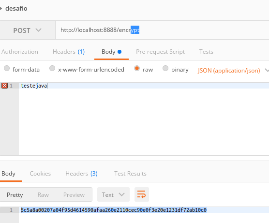

# Spring-Cloud-Configuration

Descrição: Serviço que possibilita a criação de uma configuração externalizada em um sistema distribuído. Com o Config Server você tem um lugar central, um repositório git por exemplo, para gerenciar os arquivos de configuração de cada aplicativo que se encontram rodando em outros ambientes.

### Trabalhando com confs locais:

Podemos trabalhar com diversos tipos de armazenamento de confs e um dos tipos é o armazenamento local dos arquivos:

```yml
server:
  port: 8888
spring:
  application:
    name: configserver
  profiles:
      active: native # Sem isso, o configuration não pega as confs locais...
  cloud:
    config:
      server:
        native:
          search-locations: file:////opt/idea-IU-181.4203.550/workspace/spring-microservices-in-action/configurationserver/src/main/resources/config/licensingservice
```

Como a conf acima exemplifica, você precisa informar ao spring cloud que irá utilizar a configuração nativa utilizando a seguinte propriedade:

```yml
profiles:
    active: native
```
e

```yml
server:
    native:
```

Essas configurações no yml indicam que vamos ler um arquivo local com as propriedades que queremos. A propriedade ***search-locations:*** indica a localização do arquivo.

```yml
search-locations: file:////opt/idea-IU-181.4203.550/workspace/spring-microservices-in-action/configurationserver/src/main/resources/config/licensingservice
```

### Trabalhando com confs remotas:

O tipo de configuração mais utilizada pelos microserviços é a configuração remota aonde as mesmas ficam armazenadas em um repositório no GitHub.

##### Usando SSH


```yml
server:
  port: 8888
spring:
  application:
    name: configserver
  profiles:
    active: prd
  cloud:
    config:
      server:
        encrypt.enabled: false
        git:
          uri: git@github.com:santaniello/ms-in-action-config-repo.git
          searchPaths: licensingservice,organizationservice
        label: master
```

Para utilizarmos a configuração via ssh, precisamos gerar a chave ssh na nossa maquina usando o seguinte comando no terminal:

```bash
ssh-keygen -t rsa -C "seu-email"
```

depois,  vamos até a pasta onde as chaves foram geradas e exibimos e copiamos a chave publica:

```bash
cd ~/.ssh
cat id_rsa.pub 
```

depois precisamos adicionar essa chave ao host utilizando o seguinte comando:

```bash
ssh-add
```

depois disso, basta colar a chave publica que foi copiada no github.

##### Usando HTTPS

```yml
server:
  port: 8888
spring:
  application:
    name: configserver
  profiles:
    active: prd
  cloud:
    config:
      server:
        encrypt.enabled: false
        git:
          uri: https://github.com/santaniello/ms-in-action-config-repo/
          searchPaths: licensingservice,organizationservice
          username: XXXX
          password: YYYYY
        label: master
```

Como vimos acima, a unica diferença para o ssh é que no HTTPS precisamos informar o usuário e a senha caso o repositório seja privado e a uri não possui o .git no final e sim uma / (barra).

### Como exibir as confs no browser ?

Basta colocar no browser o endpoint:

http://localhost:8888/licensingservice/sua-branch

Exemplo:

http://localhost:8888/licensingservice/prd
ou
http://localhost:8888/licensingservice/default


### Encripitação de Dados:
Com o Config Server, nossos dados ficam expostos em um repositório git e muitas vezes não queremos que alguns desses dados sejam tão visiveis assim.

Para Resolver esse problema, o Spring possui uma maneira de encripitar e desencripitar essas confs.

Passo 1: Se você usa Java 8 ou anterior, você precisa baixar o JCE da Oracle e colocar em uma pasta especifica: ***/usr/lib/jvm/java-8-oracle/jre/lib/security***

 [Download dos arquivos JCE](https://www.oracle.com/technetwork/java/javase/downloads/jce8-download-2133166.html) 
 
Se você utiliza Java 9+ esse passo não precisa ser realizado.

Passo 2:

Agora precisamos no nosso Config Server colocar uma chave de criptografia:

```yml
encrypt:
  key: fhf73odjsjkhHld98yurH983ndksku48slfhcflfdjG
```

O valor da chave é você quem escolhe.

***OBS: Essa propriedade deve estar obrigatoriamente em um bootstrap.properties, do contrário a mesma não vai funcionar***

Passo 3:

Quando colocamos a propriedade encripty no yml, o nosso Config Server ganha 2 endpoints chamados encrypt e decrypt que usaremos para encripitar e desencripitar as informações.

POST: http://localhost:8888/encrypt
POST: http://localhost:8888/decrypt

Nesse caso, vamos usar o endpoint encrypt para encriptar os dados que queremos e substituir no arquivo de configuração do nosso client no github (licenseservice por exemplo), porém, precisamos colocar um prefixo antes do dado encripitado:

***OBS: Para que a desencripitação ocorra com sucesso na aplicação, precisamos obrigatoriamente encripitar a informação utilizando o endpoint de encrypt conforme a imagem abaixo pois caso contrário, a nossa aplicação cliente não conseguirá desencripitar a informação ocasionando um erro***



spring.datasource.password: "{cipher}5c5a8a00207a04f95d4614590afaa260e2110cec90e0f3e20e1231df72ab10c0"

Repare que temos o prefixo {cipher} antes da propriedade cripitografada no nosso yml no github.

Passo 4:

E como nosso cliente vai desencripitar essa informação ?

Basta colocar a seguinte dependência no projeto cliente:

```xml
<dependency>
	<groupId>org.springframework.security</groupId>
	<artifactId>spring-security-rsa</artifactId>
</dependency>
```

***Referências:***
https://www.youtube.com/watch?v=aTSWBYwgd1U
https://www.youtube.com/watch?v=D10vKeYxn-Y
https://www.baeldung.com/spring-cloud-configuration
